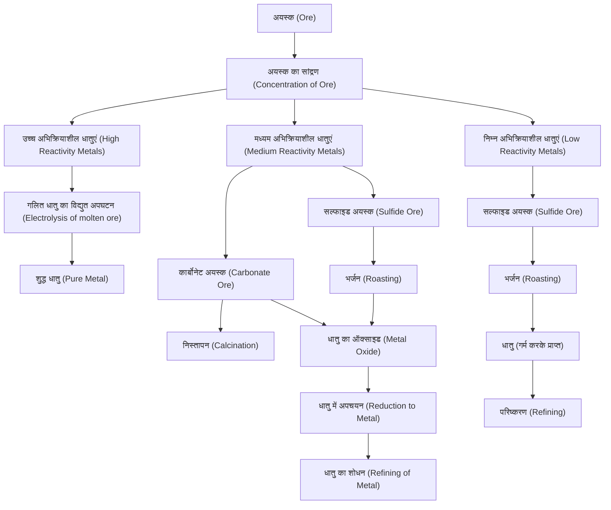

# धातु एवं अधातु (Metals and Non-Metals)

**कक्षा 10 - विज्ञान (अध्याय 3) के महत्वपूर्ण नोट्स**

यह दस्तावेज़ आपके हिंदी विज्ञान पाठ्यपुस्तक (`3.pdf`) के हाइलाइट किए गए महत्वपूर्ण अंशों और सारणियों के आधार पर तैयार किया गया है। इसमें सभी महत्वपूर्ण वैज्ञानिक शब्दों के साथ कोष्ठक (brackets) में उनके अंग्रेजी अनुवाद दिए गए हैं, ताकि मुख्य अवधारणाओं को समझने में सुगमता हो।

---

## 1. धातुओं और अधातुओं के भौतिक गुणधर्म (Physical Properties of Metals & Non-Metals)

### 1.1 धातुओं के भौतिक गुणधर्म (Physical Properties of Metals)

1. **धात्विक चमक (Metallic Luster):** शुद्ध रूप में धातु की सतह चमकदार होती है।
2. **आघातवर्ध्यता (Malleability):** धातुओं को पीटकर पतली चादर बनाया जा सकता है।
   > [!NOTE]
   > **सोना (Gold)** तथा **चाँदी (Silver)** सबसे अधिक आघातवर्ध्य (malleable) धातुएं हैं।
3. **तन्यता (Ductility):** धातुओं को पतले तारों के रूप में खींचने की क्षमता को तन्यता कहते हैं।
   - **सोना** सबसे अधिक तन्य (ductile) धातु है। मात्र $1 \text{ ग्राम (gram)}$ सोने से लगभग $2 \text{ किमी (km)}$ लंबा तार बनाया जा सकता है।
4. **ऊष्मा की चालकता (Thermal Conductivity):** धातुएं ऊष्मा की सुचालक (good conductors) होती हैं और इनका गलनांक (melting point) बहुत अधिक होता है।
   - **सबसे अच्छे सुचालक (Best conductors):** सिल्वर (चाँदी) तथा कॉपर (ताँबा)।
   - **ऊष्मा के कुचालक (Poor conductors):** लेड (सीसा) तथा मर्करी (पारा)।
5. **विद्युत की चालकता (Electrical Conductivity):** धातुएं विद्युत की सुचालक (conductors of electricity) होती हैं। विद्युत तारों पर सुरक्षा के लिए **पॉलीविनाइल क्लोराइड (PVC)** या रबर जैसी सामग्री की परत चढ़ाई जाती है।
6. **ध्वानिक (Sonorous):** जो धातुएं कठोर सतह से टकराने पर ध्वनि (आवाज़) उत्पन्न करती हैं, उन्हें ध्वानिक कहते हैं (जैसे स्कूल की घंटी)।

### 1.2 अधातुओं के भौतिक गुणधर्म (Physical Properties of Non-Metals)

- अधातुओं की संख्या धातुओं की तुलना में कम है। उदाहरण: carbon, सल्फर, आयोडीन, ऑक्सीजन, हाइड्रोजन आदि।
- **अवस्था (State):** अधिकांश अधातुएं या तो ठोस (solids) होती हैं या गैस (gases)।
  > [!IMPORTANT]
  > **ब्रोमीन (Bromine)** एकमात्र ऐसी अधातु है जो कमरे के ताप (room temperature) पर **द्रव (Liquid)** अवस्था में पाई जाती है।

### 1.3 भौतिक गुणधर्मों के अपवाद (Exceptions in Physical Properties)

- **मर्करी (Mercury / पारा):** मर्करी को छोड़कर सभी धातुएं कमरे के ताप पर ठोस होती हैं; मर्करी द्रव अवस्था में पाई जाती है।
- **गैलियम (Gallium - Ga) और सीज़ियम (Cesium - Cs):** इनका गलनांक (melting point) बहुत कम होता है। यदि इन्हें हथेली पर रखा जाए तो ये शरीर की गर्मी से ही पिघलने (melt) लगती हैं।
- **आयोडीन (Iodine - I):** यह एक अधातु है, फिर भी इसमें **चमक (Luster)** होती है।
- **कार्बन (Carbon - C) के अपररूप (Allotropes):**
  - **हीरा (Diamond):** कार्बन का एक अपररूप है। यह सबसे कठोर प्राकृतिक पदार्थ (hardest natural substance) है और इसका गलनांक व क्वथनांक (boiling point) बहुत अधिक होता है।
  - **ग्रेफाइट (Graphite):** कार्बन का दूसरा अपररूप है जो **विद्युत का सुचालक (conductor of electricity)** होता है।
- **क्षारीय धातुएं (Alkali Metals - Li, Na, K):** लीथियम, सोडियम और पोटैशियम इतनी मुलायम होती हैं कि इन्हें **चाकू से काटा जा सकता है**। इनका घनत्व (density) तथा गलनांक बहुत कम होता है।

---

## 2. धातुओं के रासायनिक गुणधर्म (Chemical Properties of Metals)

### 2.1 ऑक्सीजन के साथ अभिक्रिया (Reaction with Oxygen)

लगभग सभी धातुएं ऑक्सीजन के साथ मिलकर संगत धातु ऑक्साइड (metal oxides) बनाती हैं: (अधिकांश धातु ऑक्साइड क्षरीये (basic) होती है)
$$\text{धातु (Metal)} + \text{ऑक्सीजन (Oxygen)} \rightarrow \text{धातु ऑक्साइड (Metal Oxide)}$$

- **कॉपर की अभिक्रिया (काले रंग की परत):**
  $$2\text{Cu} + \text{O}_2 \xrightarrow{\Delta} 2\text{CuO} \quad \text{[कॉपर(II) ऑक्साइड / Copper(II) Oxide]}$$
- **एल्युमिनियम की अभिक्रिया:**
  $$4\text{Al} + 3\text{O}_2 \rightarrow 2\text{Al}_2\text{O}_3 \quad \text{[एल्युमिनियम ऑक्साइड / Aluminium Oxide]}$$

#### उभयधर्मी ऑक्साइड (Amphoteric Oxides)

> [!IMPORTANT]
> ऐसे धातु ऑक्साइड जो **अम्ल (acids) तथा क्षारक (bases) दोनों** से अभिक्रिया करके लवण (salt) और जल (water) प्रदान करते हैं, उन्हें **उभयधर्मी ऑक्साइड** कहते हैं। एल्युमिनियम ऑक्साइड ($\text{Al}_2\text{O}_3$) और जिंक ऑक्साइड ($\text{ZnO}$) इसके प्रमुख उदाहरण हैं।

- **अम्ल के साथ अभिक्रिया:**
  $$\text{Al}_2\text{O}_3 + 6\text{HCl} \rightarrow 2\text{AlCl}_3 \text{ (एल्युमिनियम क्लोराइड)} + 3\text{H}_2\text{O}$$
- **क्षारक के साथ अभिक्रिया:**
  $$\text{Al}_2\text{O}_3 + 2\text{NaOH} \rightarrow 2\text{NaAlO}_2 \text{ (सोडियम एल्युमिनेट / Sodium Aluminate)} + \text{H}_2\text{O}$$

#### ऑक्सीजन के साथ विभिन्न धातुओं की क्रियाशीलता (Reactivity)

1. **सोडियम (Na) और पोटैशियम (K):** ये हवा में रखने पर अत्यंत तेज़ी से अभिक्रिया कर आग पकड़ लेते हैं। इसलिए इन्हें सुरक्षित रखने के लिए **किरोसिन (Kerosene / मिट्टी के तेल) में डुबोकर** रखा जाता है।
2. **मैग्नीशियम (Mg), एल्युमिनियम (Al), जिंक (Zn), लेड (Pb):** सामान्य ताप पर इनकी सतह पर ऑक्साइड की पतली सुरक्षात्मक परत (protective layer) चढ़ जाती है, जो इन्हें आगे ऑक्सीकरण (oxidation) से बचाती है।
3. **आयरन (Fe):** गर्म करने पर आयरन का दहन (combustion) नहीं होता, लेकिन जब बर्नर की ज्वाला में लौह चूर्ण (iron filings) डालते हैं तो वह तेज़ी से जलने लगता है।
4. **सिल्वर (Ag) और गोल्ड (Au):** ये अत्यंत उच्च ताप पर भी ऑक्सीजन के साथ कोई अभिक्रिया नहीं करते।

#### एनोडीकरण (Anodising)

यह एल्युमिनियम पर ऑक्साइड की मोटी परत बनाने की प्रक्रिया है। एल्युमिनियम की साफ वस्तु को एनोड (anode) बनाकर तनु सल्फ्यूरिक अम्ल (dilute sulfuric acid) के साथ विद्युत-अपघटन (electrolysis) किया जाता है। इससे सतह पर ऑक्साइड की एक मोटी संक्षारण-रोधी (corrosion-resistant) सुरक्षा परत बन जाती है।

---

### 2.2 जल के साथ अभिक्रिया (Reaction with Water)

धातुएं जल से अभिक्रिया करके धातु ऑक्साइड और हाइड्रोजन गैस उत्पन्न करती हैं। जो धातु ऑक्साइड जल में घुलनशील (soluble) हैं, वे घुलकर धातु हाइड्रोक्साइड (metal hydroxide / क्षार) बनाते हैं:
$$\text{धातु (Metal)} + \text{जल (Water)} \rightarrow \text{धातु ऑक्साइड (Metal Oxide)} + \text{हाइड्रोजन (Hydrogen)}$$
$$\text{धातु ऑक्साइड} + \text{जल} \rightarrow \text{धातु हाइड्रोक्साइड}$$

- **पोटैशियम (K) और सोडियम (Na) (ठंडा जल):** अभिक्रिया अत्यंत तीव्र और ऊष्माक्षेपी (exothermic) होती है, जिससे निकलने वाली हाइड्रोजन तुरंत आग पकड़ लेती है:
  $$2\text{K}(s) + 2\text{H}_2\text{O}(l) \rightarrow 2\text{KOH}(aq) + \text{H}_2(g) + \text{ऊष्मीय ऊर्जा (Thermal Energy)}$$
  $$2\text{Na}(s) + 2\text{H}_2\text{O}(l) \rightarrow 2\text{NaOH}(aq) + \text{H}_2(g) + \text{ऊष्मीय ऊर्जा}$$
- **कैल्सियम (Ca) (ठंडा जल):** अभिक्रिया थोड़ी धीमी होती है। उत्सर्जित ऊष्मा हाइड्रोजन को जलाने के लिए पर्याप्त नहीं होती। उत्पन्न $\text{H}_2$ गैस के बुलबुले धातु की सतह पर चिपक जाते हैं, जिससे **कैल्सियम तैरना (float) प्रारंभ कर देता है**।
  $$\text{Ca}(s) + 2\text{H}_2\text{O}(l) \rightarrow \text{Ca(OH)}_2(aq) + \text{H}_2(g)$$
- **मैग्नीशियम (Mg) (गर्म जल):** यह ठंडे जल से क्रिया नहीं करता, परंतु गर्म जल के साथ अभिक्रिया कर तैरने लगता है।
- **एल्युमिनियम (Al), आयरन (Fe), जिंक (Zn) (केवल भाप / Steam):** ये ठंडे या गर्म जल से क्रिया नहीं करते, केवल भाप के साथ अभिक्रिया करते हैं:
  $$2\text{Al}(s) + 3\text{H}_2\text{O}(g) \rightarrow \text{Al}_2\text{O}_3(s) + 3\text{H}_2(g)$$
  $$3\text{Fe}(s) + 4\text{H}_2\text{O}(g) \rightarrow \text{Fe}_3\text{O}_4(s) + 4\text{H}_2(g)$$
- **लेड (Pb), कॉपर (Cu), ...:** ये जल या भाप के साथ बिल्कुल अभिक्रिया **नहीं** करते।

---

### 2.3 तनु अम्लों के साथ अभिक्रिया (Reaction with Dilute Acids)

धातुएं तनु अम्ल के साथ अभिक्रिया कर लवण (salt) और hydrogen गैस देती हैं:
$$\text{धातु (Metal)} + \text{तनु अम्ल (Dilute Acid)} \rightarrow \text{लवण (Salt)} + \text{हाइड्रोजन (Hydrogen)}$$

> [!WARNING]
> जब धातुएं **नाइट्रिक अम्ल ($\text{HNO}_3$)** के साथ अभिक्रिया करती हैं, तो **$\text{H}_2$ गैस उत्सर्जित नहीं होती**। इसका कारण यह है कि $\text{HNO}_3$ एक **प्रबल ऑक्सीकारक (strong oxidising agent)** है। यह उत्पन्न हाइड्रोजन को ऑक्सीकृत (oxidise) करके जल ($\text{H}_2\text{O}$) में बदल देता है और स्वयं नाइट्रोजन के किसी ऑक्साइड ($\text{N}_2\text{O}, \text{NO}, \text{NO}_2$) में अपचयित (reduce) हो जाता है।
> **अपवाद (Exceptions):** मैग्नीशियम ($\text{Mg}$) तथा मैंगनीज ($\text{Mn}$) अति तनु $\text{HNO}_3$ के साथ अभिक्रिया कर $\text{H}_2$ गैस उत्सर्जित करते हैं।

#### एक्वा रेजिया (Aqua Regia / रॉयल जल)

यह $3:1$ के अनुपात में **सांद्र हाइड्रोक्लोरिक अम्ल (Concentrated $\text{HCl}$)** एवं **सांद्र नाइट्रिक अम्ल (Concentrated $\text{HNO}_3$)** का ताज़ा मिश्रण होता है।

- यह अत्यंत संक्षारक (highly corrosive) और भभकता द्रव है।
- यह **गोल्ड (सोने)** और **प्लैटिनम (Platinum)** को गलाने में सक्षम है।

---

### 2.4 अन्य धातु लवणों के विलयन के साथ अभिक्रिया (Displacement Reactions)

अधिक अभिक्रियाशील धातु अपने से कम अभिक्रियाशील धातु को उसके यौगिक के विलयन (salt solution) या गलित अवस्था से विस्थापित (displace) कर देती है:
$$\text{धातु (A)} + \text{(B) का लवण विलयन} \rightarrow \text{(A) का लवण विलयन} + \text{धातु (B)}$$

---

## 3. सारणी 3.2: सक्रियता श्रेणी (Reactivity Series)

**सक्रियता श्रेणी (Reactivity Series)** वह सूची है जिसमें धातुओं की क्रियाशीलता को **अवरोही क्रम (decreasing order)** में व्यवस्थित किया गया है:

| धातु का नाम (Element Name)   | रासायनिक संकेत (Symbol) | सापेक्ष अभिक्रियाशीलता (Relative Reactivity)    |
| :--------------------------- | :---------------------: | :---------------------------------------------- |
| **पोटैशियम (Potassium)**     |            K            | **सबसे अधिक अभिक्रियाशील (Most Reactive)**      |
| **सोडियम (Sodium)**          |           Na            |                                                 |
| **कैल्सियम (Calcium)**       |           Ca            |                                                 |
| **मैग्नीशियम (Magnesium)**   |           Mg            |                                                 |
| **ऐलुमिनियम (Aluminium)**    |           Al            |                                                 |
| **जिंक (Zinc / जस्ता)**      |           Zn            | **घटती अभिक्रियाशीलता (Decreasing Reactivity)** |
| **आयरन (Iron / लोहा)**       |           Fe            |                                                 |
| **लेड (Lead / सीसा)**        |           Pb            |                                                 |
| **[हाइड्रोजन] ([Hydrogen])** |         **[H]**         | (अधातु, तुलना के लिए प्रयुक्त)                  |
| **कॉपर (Copper / ताँबा)**    |           Cu            |                                                 |
| **मर्करी (Mercury / पारा)**  |           Hg            |                                                 |
| **सिल्वर (Silver / चाँदी)**  |           Ag            |                                                 |
| **गोल्ड (Gold / सोना)**      |           Au            | **सबसे कम अभिक्रियाशील (Least Reactive)**       |

---

## 4. तत्वों का इलेक्ट्रॉनिक विन्यास एवं आयनिक यौगिक (Electronic Configuration & Ionic Compounds)

तत्वों की अभिक्रियाशीलता उनके बाह्यतम कोश यानी **संयोजकता कोश (valence shell)** को पूर्ण करके स्थायी **अष्टक (octet)** प्राप्त करने की प्रवृत्ति पर निर्भर करती है।

- **धातु:** इलेक्ट्रॉन का त्याग कर **धनायन (cation)** बनाते हैं।
- **अधातु:** इलेक्ट्रॉन ग्रहण कर **ऋणायन (anion)** बनाते हैं।

### 4.1 सारणी 3.3: कुछ तत्वों के इलेक्ट्रॉनिक विन्यास (Electronic Configurations of Some Elements)

| तत्वों के प्रकार (Type of Element) | तत्व (Element)  | परमाणु संख्या (Atomic Number) | K कोश | L कोश | M कोश | N कोश |
| :--------------------------------- | :-------------- | :---------------------------: | :---: | :---: | :---: | :---: |
| **उत्कृष्ट गैसें (Noble Gases)**   | हीलियम (He)     |               2               |   2   |       |       |       |
|                                    | निऑन (Ne)       |              10               |   2   |   8   |       |       |
|                                    | आर्गन (Ar)      |              18               |   2   |   8   |   8   |       |
| **धातुएँ (Metals)**                | सोडियम (Na)     |              11               |   2   |   8   |   1   |       |
|                                    | मैग्नीशियम (Mg) |              12               |   2   |   8   |   2   |       |
|                                    | ऐलुमिनियम (Al)  |              13               |   2   |   8   |   3   |       |
|                                    | पोटैशियम (K)    |              19               |   2   |   8   |   8   |   1   |
|                                    | कैल्सियम (Ca)   |              20               |   2   |   8   |   8   |   2   |
| **अधातुएँ (Non-Metals)**           | नाइट्रोजन (N)   |               7               |   2   |   5   |       |       |
|                                    | ऑक्सीजन (O)     |               8               |   2   |   6   |       |       |
|                                    | फ्लोरीन (F)     |               9               |   2   |   7   |       |       |
|                                    | फॉस्फोरस (P)    |              15               |   2   |   8   |   5   |       |
|                                    | सल्फर (S)       |              16               |   2   |   8   |   6   |       |
|                                    | क्लोरीन (Cl)    |              17               |   2   |   8   |   7   |       |

---

### 4.2 आयनिक यौगिकों का निर्माण (Formation of Ionic Compounds) | धातु एवं अधातु अभिक्रिया (Reaction)

विपरीत आवेशित आयन एक-दूसरे को आकर्षित करते हैं तथा मजबूत स्थिर वैद्युत बल (electrostatic force) में बँधकर **आयनिक यौगिक (Ionic Compounds)** बनाते हैं।

- **सोडियम क्लोराइड ($\text{NaCl}$) का निर्माण:**
  $$\text{Na} \rightarrow \text{Na}^+ + e^- \quad \text{[सोडियम धनायन / Sodium Cation]}$$
  $$\text{Cl} + e^- \rightarrow \text{Cl}^- \quad \text{[क्लोराइड ऋणायन / Chloride Anion]}$$
  $$\text{Na}^+ + \text{Cl}^- \rightarrow \text{NaCl}$$

### 4.3 आयनिक यौगिकों के सामान्य गुणधर्म (Properties of Ionic Compounds)

1. **भौतिक प्रकृति (Physical Nature):** मजबूत आकर्षण बल के कारण ये **ठोस एवं कठोर (solid & hard)** होते हैं। ये यौगिक सामान्यतः **भंगुर (brittle)** होते हैं और दाब डालने पर टुकड़ों में टूट जाते हैं।
2. **गलनांक एवं क्वथनांक (Melting & Boiling Points):** इनका गलनांक एवं क्वथनांक **अत्यधिक उच्च (very high)** होता है क्योंकि मजबूत अंतर-आयनिक आकर्षण (inter-ionic attraction) को तोड़ने के लिए ऊर्जा की पर्याप्त मात्रा आवश्यक है।
3. **घुलनशीलता (Solubility):** ये सामान्यतः **जल में घुलनशील (soluble in water)** तथा किरोसिन, पेट्रोल आदि जैसे कार्बनिक विलायकों (organic solvents) में **अविलेय (insoluble)** होते हैं।
4. **विद्युत चालकता (Electrical Conductivity):**
   - **ठोस अवस्था (Solid state):** ठोस संरचना में आयनों की गति संभव नहीं होने के कारण ये विद्युत का चालन **नहीं** करते।
   - **गलित अवस्था (Molten state) या जलीय विलयन (Aqueous solution):** गलित या घुली अवस्था में विपरीत आवेश वाले आयनों के बीच स्थिर वैद्युत बल ऊष्मा के कारण कमज़ोर पड़ जाता है। इसलिए आयन स्वतंत्र रूप से गमन कर विद्युत का **चालन करते हैं**।

### 4.4 सारणी 3.4: कुछ आयनिक यौगिकों के गलनांक एवं क्वथनांक (Melting & Boiling Points of Some Ionic Compounds)

| आयनिक यौगिक (Ionic Compound) | गलनांक (Melting Point - K) | क्वथनांक (Boiling Point - K) |
| :--------------------------- | :------------------------: | :--------------------------: |
| **NaCl**                     |            1074            |             1686             |
| **LiCl**                     |            887             |             1600             |
| **$\text{CaCl}_2$**          |            1045            |             1900             |
| **CaO**                      |            2850            |             3120             |
| **$\text{MgCl}_2$**          |            981             |             1685             |

---

## 5. धातुओं का निष्कर्षण (Metallurgy / Extraction of Metals)

### 5.1 शब्दावली (Key Terminology)

- **खनिज (Minerals):** पृथ्वी की भूपर्पटी (earth's crust) में प्राकृतिक रूप से पाए जाने वाले तत्वों या यौगिकों को खनिज कहते हैं।
- **अयस्क (Ores):** ऐसे खनिज जिनमें कोई विशेष धातु काफी मात्रा में होती है और उसे निकालना व्यावसायिक रूप से लाभकारी होता है।
- **गैंग (Gangue):** पृथ्वी से निकाले गए अयस्कों में पाई जाने वाली अशुद्धियां (impurities) जैसे मिट्टी, रेत, चट्टानी पदार्थ आदि।

### 5.2 अयस्क से धातु निष्कर्षण के चरण (Steps in Extraction of Metals)

#### 1. सक्रियता श्रेणी में नीचे आने वाली (निम्न) धातुओं का निष्कर्षण

ये धातुएं बहुत अनभिक्रियाशील (unreactive) होती हैं। इनके ऑक्साइड को केवल **गर्म करके** ही धातु प्राप्त की जा सकती है।

- **मर्करी का निष्कर्षण (सिनाबार अयस्क - HgS):**
  $$2\text{HgS}(s) + 3\text{O}_2(g) \xrightarrow{\Delta} 2\text{HgO}(s) + 2\text{SO}_2(g) \quad \text{[भर्जन / Roasting]}$$
  $$2\text{HgO}(s) \xrightarrow{\Delta} 2\text{Hg}(l) + \text{O}_2(g) \quad \text{[अपचयन / Reduction]}$$
- **कॉपर का निष्कर्षण (कॉपर ग्लान्स - $\text{Cu}_2\text{S}$):**
  $$2\text{Cu}_2\text{S}(s) + 3\text{O}_2(g) \xrightarrow{\Delta} 2\text{Cu}_2\text{O}(s) + 2\text{SO}_2(g)$$
  $$2\text{Cu}_2\text{O}(s) + \text{Cu}_2\text{S}(s) \xrightarrow{\Delta} 6\text{Cu}(s) + \text{SO}_2(g)$$

#### 2. सक्रियता श्रेणी के मध्य में स्थित धातुओं का निष्कर्षण

ये धातुएं (Fe, Zn, Pb, Cu) प्रायः सल्फाइड या कार्बोनेट के रूप में मिलती हैं। अपचयन से पहले इन्हें ऑक्साइड में बदलना आवश्यक है:

- **भर्जन (Roasting):** सल्फाइड अयस्क को **वायु की उपस्थिति (presence of air)** में अधिक ताप पर गर्म करके ऑक्साइड में बदलना।
  $$2\text{ZnS}(s) + 3\text{O}_2(g) \xrightarrow{\Delta} 2\text{ZnO}(s) + 2\text{SO}_2(g)$$
- **निस्तापन (Calcination):** कार्बोनेट अयस्क को **सीमित वायु (limited air)** में अधिक ताप पर गर्म करके ऑक्साइड में बदलना।
  $$\text{ZnCO}_3(s) \xrightarrow{\Delta} \text{ZnO}(s) + \text{CO}_2(g)$$
- **अपचयन (Reduction):** कार्बन (कोक) जैसे **अपचायक (reducing agent)** का उपयोग कर धातु ऑक्साइड से धातु प्राप्त करना:
  $$\text{ZnO}(s) + \text{C}(s) \xrightarrow{\Delta} \text{Zn}(g) + \text{CO}(g)$$
- **विस्थापन अभिक्रिया द्वारा अपचयन (Reduction by Displacement):** अत्यधिक अभिक्रियाशील धातुएं (Na, Ca, Al) अपचायक के रूप में प्रयुक्त की जाती हैं क्योंकि वे कम अभिक्रियाशील धातुओं को उनके ऑक्साइड से विस्थापित कर सकती हैं।
  $$3\text{MnO}_2(s) + 4\text{Al}(s) \rightarrow 3\text{Mn}(l) + 2\text{Al}_2\text{O}_3(s) + \text{ऊष्मा (Heat)}$$

  > [!TIP]
  > **थर्मिट अभिक्रिया (Thermit Reaction):** आयरन(III) ऑक्साइड ($\text{Fe}_2\text{O}_3$) के साथ एल्युमिनियम की अभिक्रिया अत्यधिक ऊष्माक्षेपी (exothermic) होती है। इसमें उत्पन्न लोहा गलित (molten) अवस्था में प्राप्त होता है। इसका उपयोग रेल की पटरी और मशीनी पुर्जों की दरारों को जोड़ने के लिए किया जाता है।
  > $$\text{Fe}_2\text{O}_3(s) + 2\text{Al}(s) \rightarrow 2\text{Fe}(l) + \text{Al}_2\text{O}_3(s) + \text{ऊष्मा}$$

#### 3. सक्रियता श्रेणी में सबसे ऊपर स्थित (उच्च) धातुओं का निष्कर्षण

इनका कार्बन द्वारा अपचयन नहीं किया जा सकता क्योंकि इन धातुओं की ऑक्सीजन के प्रति बंधुता (affinity) कार्बन से अधिक होती है। इन्हें **विद्युत अपघटनी अपचयन (Electrolytic Reduction)** द्वारा प्राप्त किया जाता है।

- उदाहरण: सोडियम को उसके गलित क्लोराइड ($\text{NaCl}$) के विद्युत अपघटन (electrolysis) से प्राप्त करते हैं:
  - **कैथोड (Cathode / ऋण इलेक्ट्रोड) पर:** $\text{Na}^+ + e^- \rightarrow \text{Na} \quad \text{(धातु निक्षेपित)}$
  - **एनोड (Anode / धन इलेक्ट्रोड) पर:** $2\text{Cl}^- \rightarrow \text{Cl}_2 + 2e^- \quad \text{(क्लोरीन गैस मुक्त)}$

### 5.3 धातुओं का परिष्करण (Refining of Metals - विद्युत अपघटनी परिष्करण)

अपचयन से प्राप्त धातुएं पूर्णतः शुद्ध नहीं होतीं। शुद्धिकरण के लिए सबसे प्रचलित विधि **विद्युत अपघटनी परिष्करण (Electrolytic Refining)** है (जैसे तांबे का शोधन):

- **एनोड (Anode):** अशुद्ध धातु (impure metal) की मोटी छड़।
- **कैथोड (Cathode):** शुद्ध धातु (pure metal) की पतली पट्टी।
- **विद्युत अपघट्य (Electrolyte):** धातु के लवण का अम्लीय विलयन (acidified metal salt solution) (जैसे कॉपर सल्फेट)।
- **एनोड पंक (Anode Mud):** अविलेय अशुद्धियां (insoluble impurities) जो एनोड के नीचे तली पर निक्षेपित हो जाती हैं।

---

## 6. संक्षारण (Corrosion) एवं सुरक्षा

### 6.1 संक्षारण के उदाहरण (Examples of Corrosion)

1. **सिल्वर (चाँदी):** खुली हवा में रखने पर काली हो जाती है। यह हवा में उपस्थित **सल्फर (Sulfur)** के साथ अभिक्रिया कर **सिल्वर सल्फाइड ($\text{Ag}_2\text{S}$)** की परत बनने के कारण होता है।
2. **कॉपर (ताँबा):** वायु में उपस्थित आर्द्र कार्बन डाइऑक्साइड ($\text{CO}_2$) के साथ अभिक्रिया करता है, जिससे उसकी सतह की भूरी चमक समाप्त हो जाती है और उस पर **हरे रंग की परत** चढ़ जाती है। यह हरा पदार्थ **बेसिक कॉपर कार्बोनेट (Basic Copper Carbonate)** होता है।
3. **आयरन (लोहा):** लंबे समय तक आर्द्र वायु (moist air) में रहने पर लोहे पर भूरे रंग की पत्रकी पदार्थ की परत चढ़ जाती है, जिसे **जंग (Rust)** कहते हैं। _(जंग लगने के लिए वायु और जल दोनों का होना आवश्यक है)_

### 6.2 संक्षारण से सुरक्षा के उपाय (Prevention of Corrosion)

- पेंट करके, तेल लगाकर, ग्रीस लगाकर।
- **यशदलेपन (Galvanisation):** लोहे एवं इस्पात को जंग से सुरक्षित रखने के लिए उन पर **जस्ते (जिंक - Zn)** की पतली परत चढ़ाने की विधि। जस्ते की परत नष्ट हो जाने के बाद भी वस्तु जंग से सुरक्षित रहती है।
- क्रोमियम लेपन (chromium plating), एनोडीकरण (anodising) या मिश्रधातु (alloy) बनाकर।

### 6.3 मिश्रधातु (Alloys)

दो या दो से अधिक धातुओं अथवा धातु एवं अधातु के समांगी मिश्रण (homogeneous mixture) को मिश्रधातु कहते हैं। मिश्रधातु बनाने से धातुओं के गुणधर्मों (properties) में सुधार होता है।

- **लोहा + कार्बन (लगभग 0.05%):** कठोर (hard) और प्रबल हो जाता है।
- **स्टेनलेस स्टील (Stainless Steel - लोहा + निकैल + क्रोमियम):** यह कठोर होता है और इसमें जंग नहीं लगता।
- **22 कैरेट सोना (22 Carat Gold):** शुद्ध सोना (24 कैरेट) बहुत नरम होता है और आभूषण बनाने के लिए उपयुक्त नहीं होता। इसलिए इसे कठोर बनाने के लिए इसमें **2 भाग ताँबा या चाँदी** मिलाया जाता है।
- **अमलगम (Amalgam):** यदि मिश्रधातु में एक धातु **मर्करी (पारा / Mercury)** हो, तो इसे अमलगम कहते हैं।
- **मिश्रधातुओं के विशिष्ट उदाहरण एवं घटक धातुएं:**

| मिश्रधातु (Alloy)   | घटक धातुएं (Components)                 | गुणधर्म / उपयोग (Properties / Uses)                                                                   |
| :------------------ | :-------------------------------------- | :---------------------------------------------------------------------------------------------------- |
| **पीतल (Brass)**    | ताँबा + जस्ता ($\text{Cu} + \text{Zn}$) | विद्युत के कुचालक (जबकि शुद्ध ताँबा विद्युत सुचालक है)।                                               |
| **काँसा (Bronze)**  | ताँबा + टिन ($\text{Cu} + \text{Sn}$)   | विद्युत के कुचालक, मेडल और मूर्तियां बनाने में प्रयुक्त।                                              |
| **सोल्डर (Solder)** | सीसा + टिन ($\text{Pb} + \text{Sn}$)    | इसका गलनांक (melting point) बहुत कम होता है। विद्युत तारों की परस्पर वेल्डिंग (welding) में प्रयुक्त। |

---

_नोट: मिश्रधातुओं की विद्युत चालकता (electrical conductivity) तथा गलनांक (melting point) शुद्ध धातुओं की तुलना में कम होता है।_
