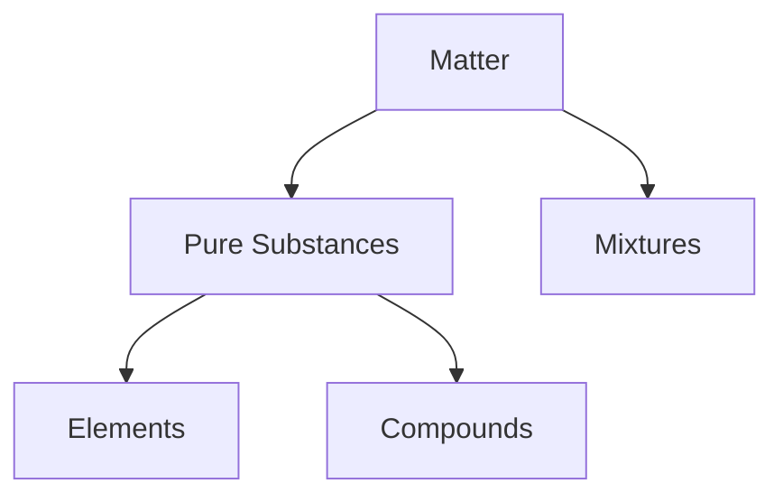

# StudyForge Documentation 🛠️
**Convert Markdown into Premium Textbook-Quality Study Materials**

StudyForge is a production-ready compilation engine that converts standard Markdown files into highly styled, print-quality HTML and A4 PDF books. It combines **Tailwind CSS v4**, **Puppeteer**, **Markdown-It**, and custom Parsers to automatically generate book-like elements (Chapter Banners, cards, reaction panels, automatic glossary index, and quick revision sheets).

---

## 1. Quick Start Guide 🚀

### Step 1: Global CLI Linking
To run the `studyforge` command from anywhere in your terminal, run `npm link` in the project root directory (`D:/Desktop/ai`):
```bash
npm link
```
*(Now you can run the `studyforge` command directly without typing `node dist/cli/index.js`)*

### Step 2: Initialize a Project
Create the default configuration (`studyforge.config.ts`) and a sample notes file (`notes.md`) in any directory:
```bash
studyforge init
```

### Step 3: Build HTML & PDF
Compile your Markdown file into print-ready HTML and PDF versions:
```bash
studyforge build notes.md
```

### Step 4: Live Editing & Preview (Hot-Reload)
Watch your file for changes and preview the results in real-time in your browser:
```bash
studyforge watch notes.md --port 3000
```
Open [http://localhost:3000](http://localhost:3000) in your browser. Whenever you save changes in `notes.md`, the browser will automatically reload!

---

## 2. Command Line Interface (CLI) Reference 💻

| Command | Description | Options / Arguments | Example |
| :--- | :--- | :--- | :--- |
| **`init`** | Initializes the default configuration and a sample notes markdown file. | None | `studyforge init` |
| **`build <file>`** | Compiles Markdown to both HTML and PDF formats. | `-c, --config <path>` (custom config) | `studyforge build notes.md` |
| **`watch <file>`** | Starts a preview server (hot-reloads browser on Markdown edits). | `-p, --port <number>` (default 3000) | `studyforge watch notes.md` |
| **`html <file>`** | Compiles Markdown to a styled HTML page only. | `-o, --output <path>`, `-c, --config <path>` | `studyforge html notes.md` |
| **`pdf <file>`** | Prints Markdown directly to a premium PDF only. | `-o, --output <path>`, `-c, --config <path>` | `studyforge pdf notes.md` |
| **`serve`** | Starts a dashboard library server to view all compiled HTML sheets. | `-p, --port <number>` (default 8080) | `studyforge serve` |
| **`theme`** | Prints out details of the active color palette and typography theme. | `-c, --config <path>` | `studyforge theme` |
| **`export <dir>`** | Exports all built HTML and PDF files in the directory to a target folder. | `<output-dir>` (required) | `studyforge export ./dist-notes` |

---

## 3. Configuration (`studyforge.config.ts`) ⚙️

You can fully customize the styling, PDF sizes, margins, headers, and footers inside `studyforge.config.ts`. Here is the default structure:

```typescript
import { StudyForgeConfig } from './src/types.js';

const config: StudyForgeConfig = {
  theme: 'light', // Choose between 'light', 'dark', 'book'
  title: 'My Study Notes',
  subtitle: 'Science & Chemistry Series',
  author: 'Your Name or Institution',
  
  // Custom brand colors mapped to Tailwind CSS variables
  colors: {
    primary: '#1e3a8a',    // Main color for headers, table titles
    secondary: '#4f46e5',  // Used for links, highlights, and bullet points
    accent: '#f59e0b',     // Focus accents (yellow/amber)
    success: '#10b981',    // Success callouts (green)
    warning: '#f97316',    // Warnings (orange)
    danger: '#ef4444'      // Caution blocks (red)
  },

  // Premium Typography Fonts
  fonts: {
    hindi: "'Noto Sans Devanagari', sans-serif",
    english: "'Inter', sans-serif",
    code: "'JetBrains Mono', monospace"
  },

  // PDF Export Margins and Settings
  pdf: {
    format: 'A4',
    landscape: false,
    margin: {
      top: '20mm',
      bottom: '20mm',
      left: '15mm',
      right: '15mm'
    },
    displayHeaderFooter: true
  },

  // Auto-generation Features
  features: {
    autoEnhance: true,      // Automatically generates glossary, revision sheets, index
    mermaid: true,          // Renders graphs & flowcharts using mermaid.js
    math: true,             // Compiles math symbols using LaTeX
    chemistry: true         // Styles reaction equations and element charges
  }
};

export default config;
```

---

## 4. Markdown Formatting Guide 📝
StudyForge supports standard Markdown alongside specific extensions tailored for premium book production.

### 4.1 Obsidian-style Callouts
Obsidian blockquote callouts are automatically converted to rounded premium cards with Lucide icons:
```markdown
> [!NOTE] This is a note
> Use this for additional remarks.

> [!TIP] A helpful study tip
> Hover effects and rounded elements are styled automatically.

> [!IMPORTANT] Important Principle
> Highly critical points.

> [!WARNING] Common Mistakes
> Alerts students about potential syllabus pitfalls.

> [!CAUTION] Danger Area
> Critical chemical safety or mathematical limitations.

> [!FORMULA] Equation Card
> Wraps math equations in a dedicated card.
```
*Supported types:* `NOTE`, `TIP`, `IMPORTANT`, `WARNING`, `CAUTION`, `QUESTION`, `SUCCESS`, `INFO`, `REMEMBER`, `EXAMPLE`, `FORMULA`, `REACTION`, `MINDMAP`, `SUMMARY`, `REVISION`, `EXAM`, `DEFINITION`.

---

### 4.2 Chemistry Reactions 🧪
To render beautiful balanced equations with reactants, products, color-coded coefficients, and custom conditions:
```markdown
::: reaction Title="Combination Reaction of Coal" Type="Combination"
C + O2 --[Heat]--> CO2
:::

::: reaction Title="Formation of Sodium Hydroxide" Type="Exothermic"
2Na + 2H2O --[Cold Water]--> 2NaOH + H2
:::
```
*   **Formula Formatting:** Symbols like `H2O` or `CO2` are automatically subscripted as $\text{H}_2\text{O}$ and $\text{CO}_2$.
*   **Charges:** Charges like `Na+`, `Mg2+`, `SO4^2-` are superscripted as $\text{Na}^+$, $\text{Mg}^{2+}$, and $\text{SO}_4^{2-}$.

---

### 4.3 Definition Lists (Double Colon Syntax)
Write terms and definitions in a single line using `::`. They compile into clean, indented textbook glossary rows:
```markdown
धातु:: ऊष्मा और विद्युत की सुचालक होती हैं।
अधातु:: कमरे के ताप पर ठोस या गैस अवस्था में पाई जाती हैं (ब्रोमीन को छोड़कर)।
```

---

### 4.4 LaTeX Mathematics
Input block math using `$$` and inline math using `$`:
```markdown
यह एक मुख्य रासायनिक दर सूत्र है:
$$ E = mc^2 $$
जहाँ $c$ प्रकाश की गति है।
```

---

### 4.5 Mermaid Flowcharts & Mindmaps
Generate responsive flowcharts inside code fences:


---

## 5. Automatic Textbook Enhancements ✨
When `autoEnhance: true` is enabled in your configuration, StudyForge scans the markdown AST (Abstract Syntax Tree) to extract elements and automatically append the following sections to the end of the document:

1. **त्वरित दोहराव (Quick Revision Sheet):** Gathers all points inside `[!IMPORTANT]` and `[!REMEMBER]` callouts, along with formulas, and places them in a summary sheet.
2. **शब्दावली (Glossary & Definitions):** Extracts definitions using the `::` syntax or defined via sentences ending in "कहते हैं" / "refers to" and compiles a glossary index.
3. **रासायनिक अभिक्रिया सारांश (Reactions Sheet):** Collates all reaction panels in the chapter into a reference page.
4. **मुख्य शब्द अनुक्रमणिका (Keyword Index):** Indexes key terms alphabetically at the end of the document.

---

## 6. Page Break Management for Print 🖨️
To ensure a page breaks at a specific point in the PDF output, insert the following utility tag:
```html
<div class="page-break-before"></div>
```
StudyForge automatically prevents elements like tables, callout cards, reaction cards, and code blocks from splitting awkwardly across pages (`page-break-inside: avoid`).

---

## 7. How to Setup on Another PC 💻
If you upload this project to GitHub, anyone (including yourself on another computer) can set up and run the app by following these simple steps:

### Prerequisites
Make sure **Node.js 22+** is installed on the target machine.

### Installation Steps

1. **Clone the repository:**
   ```bash
   git clone <your-repository-url>
   cd D:/Desktop/ai   # (or navigate to the cloned folder)
   ```

2. **Install all dependencies:**
   ```bash
   npm install
   ```
   *(Note: This downloads all packages, including Puppeteer. Puppeteer will automatically download a matching version of Chromium for PDF printing).*

3. **Build the TypeScript code:**
   ```bash
   npm run build
   ```
   *(This compiles all source files inside the `src/` folder into executable JavaScript in the `dist/` folder).*

4. **Link the global command (Optional):**
   ```bash
   npm link
   ```
   *(Run this inside the project folder. You may need to run this command as an Administrator on Windows. Once linked, you can type `studyforge` globally from any terminal).*

5. **Generate notes:**
   ```bash
   # Using the global shortcut (if linked):
   studyforge build notes.md
   
   # Or using Node directly (always works):
   node dist/cli/index.js build notes.md
   ```
